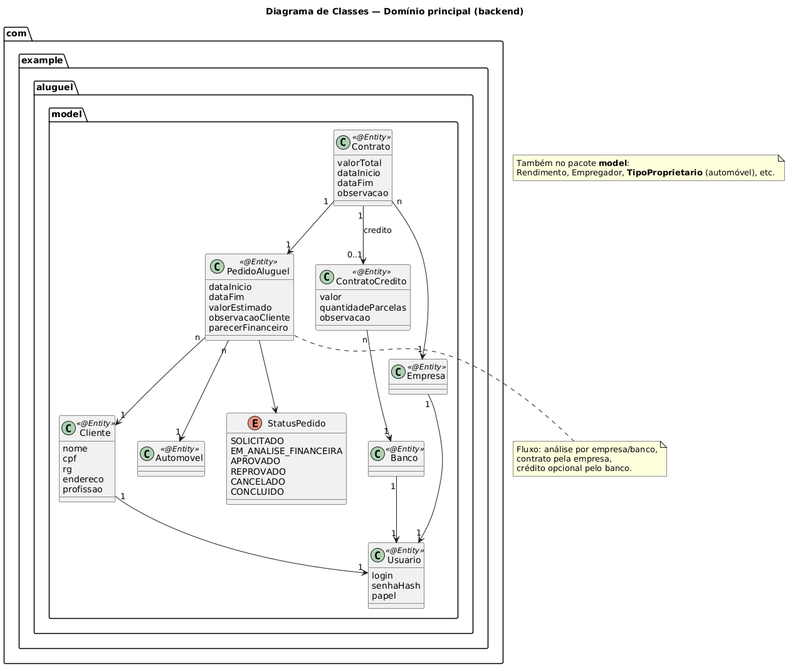
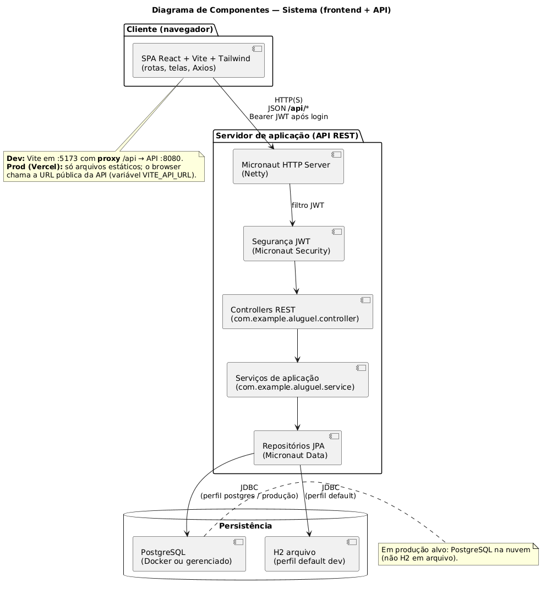
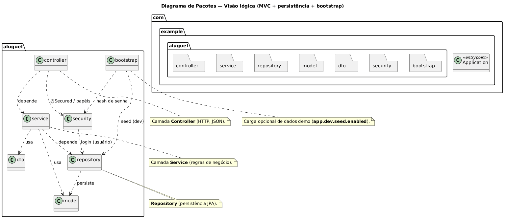
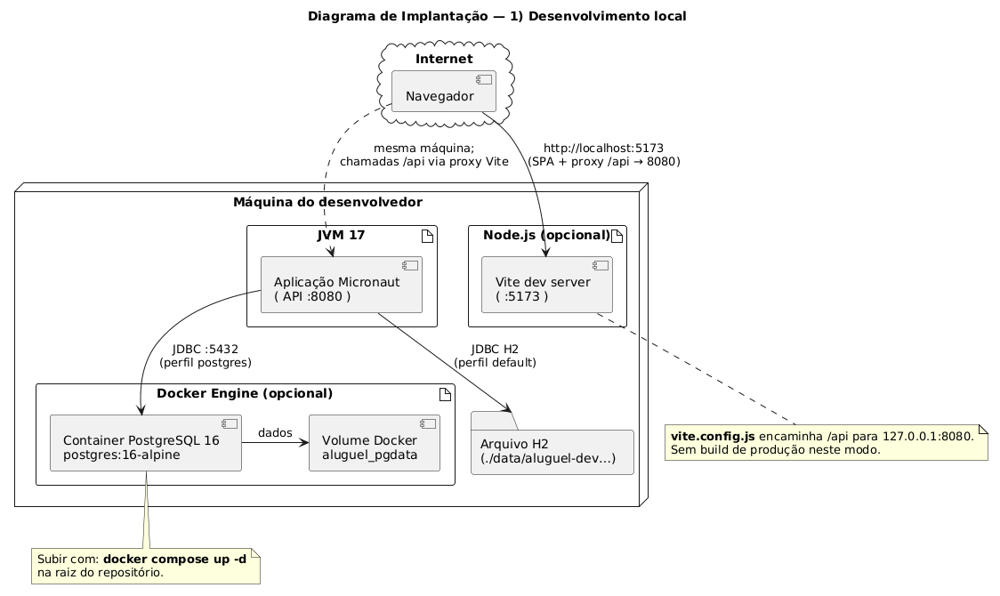

# Sistema de Aluguel de Carros

Repositório do projeto acadêmico da disciplina **Laboratório de Desenvolvimento de Software** (PUC Minas — Engenharia de Software), com **API REST (Micronaut)** e **frontend SPA (React + Vite + Tailwind 4.2)** integrados, além de testes automatizados (JUnit no backend, Vitest no front).

## Objetivo do sistema (especificação)

- Cadastro prévio obrigatório para uso do sistema.
- Clientes: introduzir, modificar, consultar e cancelar pedidos de aluguel.
- Agentes (empresas e bancos): modificar e avaliar pedidos; fluxo financeiro e contratos.
- Dados de contratantes: identificação (RG, CPF, nome, endereço), profissão, empregadores e até **três** rendimentos.
- Automóveis: matrícula, ano, marca, modelo, placa; propriedade pode ser de cliente, empresa ou banco.
- Aluguel pode associar-se a contrato de crédito concedido por banco agente.

Fonte: enunciado LAB02 — *Sistema de Aluguel de Carros*.

## Funcionalidades (estado atual)

- **API REST em Micronaut 4** com **MVC** (controllers, services, repositories, DTOs).
- **Segurança JWT** e papéis `ROLE_CLIENTE`, `ROLE_EMPRESA`, `ROLE_BANCO`.
- **Pedidos:** cliente cria pedido (automóvel + período); status (`SOLICITADO` → `EM_ANALISE_FINANCEIRA` → `APROVADO` / `REPROVADO`, `CANCELADO` quando permitido).
- **Agentes:** iniciam análise e registram **parecer financeiro** (aprovação/reprovação).
- **Contratos:** empresa gera contrato com pedido **APROVADO**; pedido pode ir a **CONCLUIDO**.
- **Crédito (opcional):** banco associa financiamento a contrato existente.
- **Frontend:** login, cadastro, dashboards, pedidos, automóveis, contratos e crédito; **CORS** para origem do Vite.
- **Testes:** backend (JUnit / Micronaut Test); frontend (Vitest + Testing Library).

## Tecnologias utilizadas

| Camada | Tecnologia | Detalhes |
| --- | --- | --- |
| **Backend** | Java **17**, Micronaut **4.10.x** | HTTP Netty, injeção de dependências, validação (`micronaut-validation`). |
| **Segurança** | Micronaut Security + JWT | Login `username`/`password`, `@Secured`, BCrypt. |
| **Persistência** | Micronaut Data JPA + Hibernate | Repositórios; `hbm2ddl.auto=update` em dev. |
| **Banco (dev)** | H2 (arquivo) ou PostgreSQL (Docker) | Ver `application.properties` e `docker-compose.yml`. |
| **API JSON** | Micronaut Serde | DTOs de entrada/saída. |
| **Testes API** | JUnit 5, Micronaut Test | Cliente HTTP embutido. |
| **Frontend** | React 19, Vite 8, Tailwind 4.2 | Axios, React Router; papéis derivados do JWT; Vitest. |

## Arquitetura do backend

Pacote base: `com.example.aluguel`.

| Camada | Pacote / papel |
| --- | --- |
| **HTTP** | `controller` — recursos REST, validação Bean Validation, `@Secured` por papel (`ROLE_*`). |
| **Regras** | `service` — pedidos, contratos, crédito, clientes, automóveis; autorização por `Authentication`. |
| **Dados** | `repository` — Micronaut Data JPA (interfaces `JpaRepository`). |
| **Domínio** | `model` — entidades JPA (`Usuario`, `Cliente`, `Empresa`, `Banco`, `Automovel`, `PedidoAluguel`, `Contrato`, etc.). |
| **Contratos API** | `dto` — requests/responses (Serde). |
| **Segurança** | `security` — `UsuarioAuthenticationProvider`, `PasswordHasher`, constantes `Roles`. |
| **Carga dev** | `bootstrap` — seed opcional (`app.dev.seed.enabled`) ao subir a aplicação. |

Fluxo típico: **Controller** → **Service** → **Repository** → banco; erros de negócio como `HttpStatusException`.

- Configuração: `backend/src/main/resources/application.properties` (H2 arquivo em `./data/` relativo ao diretório de trabalho do processo; em dev costuma ser `backend/data/` ao rodar `mvnw` na pasta `backend`).
- Testes isolam com H2 em memória: `src/test/resources/application-test.properties` (sem seed).

## Arquitetura do frontend

Aplicação **SPA** em `frontend/src`, roteada pelo React Router.

| Parte | Conteúdo |
| --- | --- |
| **Entrada** | `main.jsx` — monta o root; `App.jsx` — rotas públicas (`/login`, `/register`) e área autenticada com `Layout`. |
| **Estado de sessão** | `context/AuthContext.jsx` — login (`access_token`), armazenamento em `localStorage`, papéis extraídos do JWT (`utils/jwt.js`). |
| **HTTP** | `api/client.js` — Axios com `Authorization: Bearer` e interceptor 401. Em dev, `baseURL` vazio usa o **proxy** do Vite (`vite.config.js`: `/api` → `http://127.0.0.1:8080`). |
| **Páginas** | `pages/` — `Login`, `RegisterCliente`, `DashboardPage` (cliente vs agente), `PedidosPage`, `AutomovelPage`, `ContratosPage`, `CreditosPage`. |
| **Componentes** | `components/` — `Layout`, `Sidebar`, `Topbar`, `ProtectedRoute`, `StatusBadge`, `ValidationNotice`. |
| **Utilitários** | `utils/` — CPF/RG, máscaras, mensagens de rede, validação de login. |
| **Testes** | `*.test.js` / `*.test.jsx`, `src/test/setup.js` — Vitest + Testing Library. |

Papéis na UI: `CLIENTE`, `EMPRESA`, `BANCO` (a partir das `ROLE_*` no token), não o termo genérico “AGENTE”.

## Estrutura de pastas (principal)

```text
SistemaAluguelCarros/
├── backend/                          # API Micronaut (Maven, Java 17)
│   ├── src/main/java/com/example/
│   │   ├── Application.java
│   │   └── aluguel/
│   │       ├── bootstrap/             # Seed opcional (dev)
│   │       ├── controller/
│   │       ├── service/
│   │       ├── repository/
│   │       ├── model/
│   │       ├── dto/
│   │       └── security/
│   ├── src/main/resources/
│   │   ├── application.properties
│   │   └── application-postgres.properties
│   └── src/test/
├── frontend/
│   ├── src/
│   │   ├── api/                       # Cliente Axios
│   │   ├── components/
│   │   ├── context/
│   │   ├── pages/
│   │   ├── utils/
│   │   ├── App.jsx
│   │   └── main.jsx
│   ├── vite.config.js                 # proxy /api → backend
│   └── package.json
├── docs/Documentação/                 # PlantUML + PNG exportados (Imagens/)
├── docker-compose.yml
└── README.md
```

## Como rodar o projeto (desenvolvimento)

1. **JDK 17** instalado e `JAVA_HOME` apontando para ele (obrigatório para o Maven/Micronaut).
2. **Terminal 1 — backend** (na pasta `backend` do repositório):
   ```powershell
   cd backend
   .\mvnw.bat mn:run
   ```
   - API: [http://localhost:8080](http://localhost:8080)
   - Se a porta **8080** estiver ocupada, encerre o outro processo ou altere `micronaut.server.port` em `application.properties`.
3. **Terminal 2 — frontend** (na pasta `frontend`):
   ```powershell
   cd frontend
   npm install
   npm run dev
   ```
   - Interface: [http://localhost:5173](http://localhost:5173) — as chamadas a `/api/...` são encaminhadas ao backend pelo Vite.
4. **Login rápido (com seed ativo):** use `clientedemo` / `senha123` (ou `empresademo`, `bancodemo` — mesma senha). Veja a tabela na seção [Dados de demonstração](#dados-de-demonstracao).

**Build de produção (front):** defina `VITE_API_URL` com a URL base da API (sem `/` no final) e execute `npm run build`; o Axios usa essa base fora do modo `import.meta.env.DEV`.

**Testes:**

```powershell
cd backend; .\mvnw.bat test
cd frontend; npm test
```

Os testes da API sobem o Micronaut em **porta aleatória** (`application-test.properties`: `micronaut.server.port=-1`), para não conflitar com a API em desenvolvimento na 8080.

## API REST

**Autenticação:** `Authorization: Bearer <access_token>` após `POST /api/auth/login` com corpo `username` e `password`. Segredo JWT: variável `JWT_SECRET` (opcional em dev; ver `application.properties`).

| Método | Caminho | Descrição |
| --- | --- | --- |
| `GET` | `/` | Informações básicas da API (público). |
| `POST` | `/api/auth/register/cliente` | Cadastro de cliente. |
| `POST` | `/api/auth/register/agente` | Cadastro empresa ou banco. |
| `POST` | `/api/auth/login` | Login (`username`, `password`). |
| `GET` | `/api/me` | IDs de perfil (`clienteId` / `empresaId` / `bancoId`). |
| `GET` | `/api/clientes` | Lista / políticas por papel. |
| `GET` | `/api/clientes/{id}` | Detalhe. |
| `POST` | `/api/clientes` | Cria cliente (empresa ou banco). |
| `PUT` | `/api/clientes/{id}` | Atualiza perfil. |
| `DELETE` | `/api/clientes/{id}` | Remove. |
| `GET` | `/api/automoveis` | Lista. |
| `GET` | `/api/automoveis/{id}` | Detalhe. |
| `POST` | `/api/automoveis` | Cria (empresa ou banco). |
| `PUT` | `/api/automoveis/{id}` | Atualiza. |
| `DELETE` | `/api/automoveis/{id}` | Remove. |
| `GET` | `/api/pedidos` | Lista (cliente: só seus; agentes: todos). |
| `GET` | `/api/pedidos/{id}` | Detalhe. |
| `POST` | `/api/pedidos` | Cria (cliente). |
| `PUT` | `/api/pedidos/{id}` | Atualiza (cliente, só `SOLICITADO`). |
| `POST` | `/api/pedidos/{id}/cancelar` | Cancela (cliente). |
| `POST` | `/api/pedidos/{id}/iniciar-analise` | Inicia análise (empresa/banco). |
| `POST` | `/api/pedidos/{id}/decisao` | Decisão com parecer (empresa/banco). |
| `GET` | `/api/contratos` | Lista. |
| `GET` | `/api/contratos/{id}` | Detalhe (+ crédito se houver). |
| `POST` | `/api/contratos` | Cria contrato (empresa). |
| `POST` | `/api/contratos/{id}/credito` | Crédito (banco). |

<a id="dados-de-demonstracao"></a>

### Dados de demonstração (desenvolvimento)

Com `app.dev.seed.enabled=true` em `application.properties`, na **primeira subida** (se os logins ainda não existirem) são criados usuários e um cenário mínimo (veículo + pedido). **Em produção, defina `app.dev.seed.enabled=false`.**

| Login | Senha | Papel |
| --- | --- | --- |
| `clientedemo` | `senha123` | Cliente |
| `empresademo` | `senha123` | Empresa |
| `bancodemo` | `senha123` | Banco |

### PostgreSQL opcional (Docker)

Na raiz do repositório:

```powershell
docker compose up -d
```

Subir o Micronaut com perfil `postgres`:

```powershell
cd backend
$env:MICRONAUT_ENVIRONMENTS = "postgres"
.\mvnw.bat mn:run
```

Credenciais no `docker-compose.yml` (usuário/senha/banco `aluguel`). O seed obedece a `app.dev.seed.enabled`.

### Banco H2 (padrão local)

URL configurada em `application.properties` (arquivo `aluguel-dev`, pasta `data` junto ao processo). Não combine opções incompatíveis do H2 2.x (comentário no próprio arquivo). Se aparecer “banco em uso”, feche outras instâncias que apontem para o mesmo arquivo.

## Documentação e diagramas UML (PlantUML)

| Fonte (`.puml`) | Conteúdo | Figura exportada (PNG) |
| --- | --- | --- |
| [classes.puml](docs/Documentação/classes.puml) | Entidades principais do domínio (pedido, contrato, usuário/cliente/empresa/banco). | [Diagrama de classes](docs/Documentação/Imagens/Diagrama-de-Classes.png) |
| [componentes.puml](docs/Documentação/componentes.puml) | Frontend SPA ↔ API Micronaut ↔ H2/PostgreSQL. | [Diagrama de componentes](docs/Documentação/Imagens/Diagrama-de-Componentes.png) |
| [pacotes.puml](docs/Documentação/pacotes.puml) | Pacotes Java (`controller`, `service`, `repository`, `bootstrap`, …). | [Diagrama de pacotes](docs/Documentação/Imagens/Diagrama-de-Pacotes.png) |
| [implantacao.puml](docs/Documentação/implantacao.puml) | **Duas páginas:** desenvolvimento local (Vite + API + H2/Docker) e **alvo de produção** (Vercel + API + PostgreSQL). | [Diagrama de implantação](docs/Documentação/Imagens/Diagrama-de-Implantação.png) |

Resumo textual: [docs/arquitetura.md](docs/arquitetura.md).

Abra os `.puml` no plugin PlantUML da IDE ou em [plantuml.com](https://www.plantuml.com/plantuml/) (arquivo `implantacao.puml` gera **dois diagramas** em sequência: use *Next* no visualizador se houver paginação). **Regenerar os PNG** após editar os `.puml` para manter as figuras alinhadas ao código.

### Pré-visualização das figuras (repositório)

Diagrama de classes:



Diagrama de componentes:



Diagrama de pacotes:



Diagrama de implantação:



## Validação no cadastro (CPF / RG) — frontend

No cadastro de **cliente**, há máscara de CPF (`000.000.000-00`) e normalização do RG; regras em `frontend/src/utils/cpf.js`, `rg.js` e `masks.js`, com mensagens abaixo dos campos e no envio do formulário.

## Roadmap em etapas

| Etapa | Conteúdo |
| --- | --- |
| **1** | Micronaut MVC, H2 + Postgres opcional, CRUD cliente, testes, README, PlantUML. |
| **2** | JWT, papéis, usuário x cliente/empresa/banco, automóveis, CORS. |
| **3** | Pedidos (status, análise, decisão), contratos e crédito. |
| **4** | Frontend React + Vite + Tailwind; integração API; Vitest. |
| **5** | Revisão UML e alinhamento final para entrega. |

## Autores

| Nome | GitHub | LinkedIn |
| --- | --- | --- |
| **Alice Shikida** | [GitHub](https://github.com/aliceshikida) | [LinkedIn](https://www.linkedin.com/in/alice-shikida/) |
| **Matheus Felipe Correa** | [GitHub](https://github.com/MatheusFelipeCorrea) | [LinkedIn](https://www.linkedin.com/in/matheus-felipe-correa-29b262265/) |

---

## Demonstração

*(Prints e link de deploy podem ser adicionados nas sprints finais.)*
